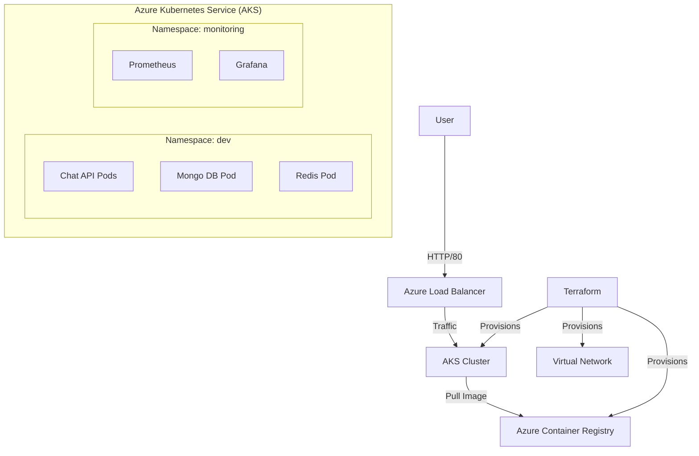
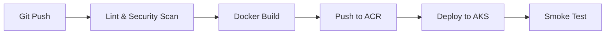

# 📘 DevOps Final Project Report

**Project Name:** ChatRoom DevOps  
**Date:** December 16, 2025  
**Repository:** [https://github.com/MAS191/chatroom-devops](https://github.com/MAS191/chatroom-devops)

---

## 1. 🛠️ Technologies Used

We selected a cloud-native stack to ensure scalability, reliability, and automation.

| Component | Technology | Justification |
|-----------|------------|---------------|
| **Source Control** | Git & GitHub | Industry standard for version control and collaboration. |
| **CI/CD** | GitHub Actions | Integrated directly with repo; supports matrix builds and Azure login. |
| **Containerization** | Docker | Ensures consistency across Dev, Test, and Prod environments. |
| **IaC** | Terraform | Declarative infrastructure management; prevents configuration drift. |
| **Orchestration** | Azure Kubernetes Service (AKS) | Managed K8s service for high availability and scaling. |
| **Config Mgmt** | Ansible | Automates the application of K8s manifests and namespace management. |
| **Monitoring** | Prometheus & Grafana | Standard open-source stack for metrics collection and visualization. |
| **Database** | MongoDB & Redis | NoSQL for flexible chat storage; Redis for high-speed message caching. |

---

## 2. 🏗️ Pipeline & Infrastructure Diagram

### Infrastructure Architecture (Azure)
The infrastructure is provisioned in the `southeastasia` region within a single Resource Group.



### CI/CD Pipeline Flow
Our GitHub Actions pipeline ensures code quality and automated deployment.



---

## 3. 🔐 Secret Management Strategy

We implemented a multi-layered security approach to ensure no sensitive data is hardcoded.

1.  **Infrastructure Secrets (Azure):**
    *   Managed via **GitHub Secrets** (`AZURE_CREDENTIALS`).
    *   Injected into the CI/CD pipeline at runtime.

2.  **Application Secrets (Flask & DB):**
    *   Stored as **Kubernetes Secrets** (Base64 encoded).
    *   Mounted as environment variables in the Pods.

    *Snippet from `k8s/secret.yaml`:*
    ```yaml
    apiVersion: v1
    kind: Secret
    metadata:
      name: chat-secrets
      namespace: dev
    type: Opaque
    stringData:
      FLASK_SECRET: "super-secure-random-string"
      MONGO_URI: "mongodb://mongo:27017/chatdb"
    ```

3.  **Container Registry Access:**
    *   AKS is granted `AcrPull` role via **Managed Identity**, eliminating the need for Docker login credentials on the nodes.

---

## 4. 📊 Monitoring Strategy

We adopted the **"Observability as Code"** pattern.

1.  **Metrics Collection (Prometheus):**
    *   Configured to scrape the `/metrics` endpoint of the Chat API.
    *   Also collects Kubernetes node metrics (CPU, Memory, Disk).

2.  **Visualization (Grafana):**
    *   **Datasource:** Prometheus is automatically provisioned via ConfigMap.
    *   **Dashboards:** Dashboards are defined in JSON and mounted into the Grafana container, ensuring they persist across restarts.

    *Snippet from `monitoring/prometheus.yaml`:*
    ```yaml
      - job_name: chat-api
        metrics_path: /metrics
        static_configs:
          - targets: ["chat-api.dev.svc.cluster.local:80"]
    ```

---

## 5. 💡 Lessons Learned

Throughout this project, we encountered and solved several challenges:

*   **State Management in K8s:** We learned that Pods are ephemeral. To persist database data, we had to implement **PersistentVolumeClaims (PVCs)** mapped to Azure Managed Disks.
*   **Public IP Quotas:** We initially tried to expose every service (Grafana, Prometheus, Mongo) via LoadBalancer but hit Azure's quota limits. We resolved this by using `ClusterIP` for internal services and `kubectl port-forward` for secure administrative access.
*   **CI/CD Security:** Integrating **Bandit** for security scanning in the pipeline helped us catch potential vulnerabilities (like hardcoded passwords) before they reached production.
*   **IaC Drift:** Using Terraform taught us the importance of the state file. We learned to never manually modify Azure resources, as Terraform would overwrite them on the next run.

---

## 6. 📸 Screenshots & Evidence

### Step 2: Infrastructure (Terraform)
**Terraform Output:**


**Terraform Destroy Plan:**


### Step 4: Configuration Management (Ansible)
**Ansible Playbook Run:**


### Step 5: Kubernetes Deployment
**Pods & Services Status:**


### Step 6: CI/CD Pipeline
**GitHub Actions Success:**


### Step 7: Monitoring
**Grafana Dashboard:**

